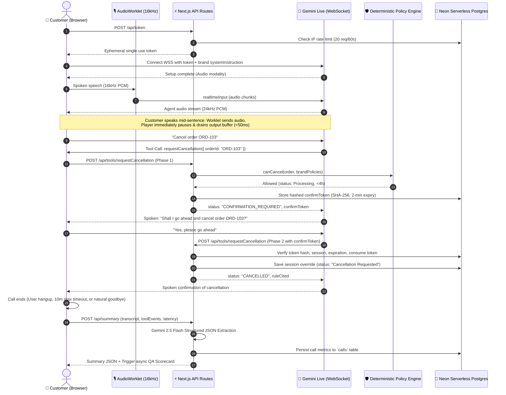

# Aria — Autonomous Multimodal AI Voice Support Agent

> **Production-grade multimodal voice agent with deterministic policy guardrails, sub-500ms voice streaming, two-phase order mutations, and multi-brand customer service.** Built for **Aura Skincare** (Ayurvedic botanical skincare) and **Kaveri Coffee Roasters** (Artisanal Chikmagalur specialty coffee).

[-black?style=flat&logo=next.js)](https://nextjs.org/)
[](https://react.dev/)
[](https://ai.google.dev/)
[](https://groq.com/)
[](https://neon.tech/)
[](https://tailwindcss.com/)
[](https://www.framer.com/motion/)
[](https://vitest.dev/)
[](https://vercel.com/)

---

## 🌐 Live Deployment & Links

- **Live Production URL:** [https://aura-aria.vercel.app](https://aura-aria.vercel.app) *(or your deployed Vercel domain)*
- **Observability & Analytics Dashboard:** [https://aura-aria.vercel.app/insights](https://aura-aria.vercel.app/insights)
- **System Health Status Endpoint:** [https://aura-aria.vercel.app/api/health](https://aura-aria.vercel.app/api/health)

---

## 📸 Interface Screenshots

<!-- Screen 1: Active Voice Call with Audio-Reactive Orb and Live Transcript -->
| Active Voice Call & Live Audio Orb | Agent Brain & Decision Engine |
| :---: | :---: |
|  <br><sub>*Bidirectional 16kHz/24kHz PCM voice streaming, audio-reactive Orb, latency badge, and live streaming transcript.*</sub> |  <br><sub>*Glass-box cognitive timeline: intent classification, tool executions, policy citations, and collapsible JSON payloads.*</sub> |

<!-- Screen 2: Post-Call Intelligence and Public Insights Dashboard -->
| Post-Call Intelligence & QA Scorecard | Public Insights & KPI Dashboard |
| :---: | :---: |
|  <br><sub>*Structured JSON extraction (intent, sentiment, resolution), user voice audio replay scrubber, and automated 5-point QA scorecard.*</sub> |  <br><sub>*Real-time operational KPIs: volume, duration, p50 latency histogram, resolution donut, intent breakdown, and call drawer.*</sub> |

---

## 🏛️ System Architecture

```
┌────────────────────────────────────────────────────────────────────────────────────────┐
│                                ARIA SYSTEM ARCHITECTURE                                │
│                                                                                        │
│   [Customer Mic] ──(16kHz Mono PCM)──> [AudioWorklet] ──> [Gemini Live WebSocket]      │
│                                                                   │                    │
│   [Audio Player] <──(24kHz PCM)── [Instant Barge-in Drain] <──────┘ (Audio chunks)     │
│          │                                                                             │
│          ▼                                                                             │
│   [Gemini Tool Call] ──> [/api/tools/[name]] ──────────────────┐                       │
│                                                                ▼                       │
│                                                   [Deterministic Policy Engine]        │
│                                                   - 4h cancel window (Aura) / 2h (Kav) │
│                                                   - 7d return window / 0d perishable   │
│                                                   - 48h damage photo replacement       │
│                                                   - 2-Phase confirmToken verification  │
│                                                                │                       │
│                                                                ▼                       │
│                                                   [Neon Serverless Postgres]           │
│                                                   - orders & session_overrides         │
│                                                   - cancel_confirmations (SHA-256)     │
│                                                   - tickets & calls logs               │
│                                                                                        │
│   [Fallback Path]  Web Speech API STT  ──>  Groq Cloud LLM  ──>  SpeechSynthesis TTS   │
│   [Post-Call Intelligence] Gemini 2.5 Flash Summary + 5-Dimension QA Scorecard         │
└────────────────────────────────────────────────────────────────────────────────────────┘
```



---

## ✨ Implemented Features (P0 – P18)

### 1. Multimodal Realtime Voice (`useRealtimeAgent`)
- **Direct Gemini Live Streaming:** Direct WebSocket bi-directional audio to `gemini-2.5-flash-native-audio-preview-12-2025` using secure server-minted ephemeral tokens.
- **Microphone Pipeline:** Custom browser `AudioWorklet` (`/worklets/mic-processor.js`) capturing clean 16kHz mono 16-bit PCM.
- **Client-Side Barge-In / Interruption:** Web Audio API `Pcm16Player` queues 24kHz audio chunks and immediately pauses, drains, and resets output buffers within <50ms upon customer speech.
- **Turn Latency Tracking:** High-precision client-side performance counter tracking user speech offset to first audio chunk (p50, avg, history).

### 2. Zero-Downtime Classic Voice Fallback (`useClassicAgent` & `useAgent`)
- **Automatic Failover:** Automatically switches from Realtime to Classic fallback mode if:
  - Ephemeral token minting fails (`QUOTA_OR_UNAVAILABLE` or HTTP 429/503).
  - WebSocket disconnects twice or drops during audio setup.
  - Browser does not support Web Audio Worklets.
- **Classic Voice Stack:** Browser Web Speech API (`SpeechRecognition`) + Groq Cloud LLM (`openai/gpt-oss-120b` or `llama-3.3-70b-versatile`) + Browser `speechSynthesis` (with Indian English `en-IN` accent voice selection).
- **Manual Mode Switcher & Persistence:** Users can toggle between `realtime` and `classic` modes via the UI navbar; preferences persist in `sessionStorage`.

### 3. Server-Guarded Business Tools & Two-Phase Mutation
- **`getOrderDetails`:** Normalizes spoken order IDs (handles spoken digits, dashes, and phonetic letters). Cross-references Neon Postgres with session-specific overrides. Evaluates policy eligibility flags (`canCancel`, `canReturn`, `canReportDamage`, `shippingFee`, `codAvailable`) with machine-readable `ruleCited` codes.
- **Two-Phase `requestCancellation` Flow (Server-Enforced):**
  - **Phase 1 (Eligibility & Token Issuance):** Verifies order status is `Processing` and placed within the brand window. Mints a single-use SHA-256 hashed `confirmToken` with a 2-minute expiration in the `cancel_confirmations` table. Returns `CONFIRMATION_REQUIRED`.
  - **Conversational Confirmation:** Aria is instructed by prompt and tool contract to ask: *"Shall I go ahead and cancel order X?"*
  - **Phase 2 (Destructive Execution):** Only called when customer confirms. Validates token hash, session ID matching, expiration (<2m), and single-use status before marking order as `Cancellation Requested`. Rejects invalid, stolen, or expired tokens.
- **`createSupportTicket`:** Sanitizes input strings, validates categories (`DAMAGED_DEFECTIVE`, `DELIVERY_ISSUE`, `OTHER`), and writes customer inquiries into the `tickets` table with tracking IDs.

### 4. Deterministic Three-Layer Policy Guardrails
- **Layer 1 (System Prompt):** Strict persona guidelines forbidding medical diagnoses, competitor disparagement, delivery time promises, or refund guarantees.
- **Layer 2 (Deterministic Code in `lib/policy.js`):** Pure functions evaluating hard business rules independent of LLM whims:
  - **Cancellation:** Allowed only if `Processing` (within 4 hours for Aura, 2 hours for Kaveri).
  - **Returns:** Allowed only within 7 days of delivery for unopened items (Aura); 0-day return policy for Kaveri (freshly roasted coffee is a perishable food consumable).
  - **Damaged Items:** Must be reported within 48 hours (Aura) or 24 hours (Kaveri) with photos for a replacement.
- **Layer 3 (Database & API Enclosure):** Tool API endpoints validate arguments server-side, preventing state pollution.

### 5. Multi-Brand Architecture (P18)
- **Supported Brands:**
  - **Aura Skincare:** Premium clean Ayurvedic skincare. Persona: *Aria* (Aoede voice). Order prefix: `ORD-`. Policies: 7-day returns, 4-hour cancellation, Rs 499 free shipping.
  - **Kaveri Coffee Roasters:** Artisanal Chikmagalur specialty coffee. Persona: *Tara* (Puck voice). Order prefix: `KAV-`. Policies: Non-returnable perishable consumable, 2-hour cancellation, Rs 799 free shipping.
- **End-to-End Wiring:**
  - Database schema includes `brands` table and `orders.brand_id REFERENCES brands(id)`.
  - `Navbar.js` brand toggle switches active brand with animated indicators.
  - Dynamic CSS custom properties update UI theme colors (Aura gold vs. Kaveri copper/amber).
  - Dynamic `buildSystemInstruction(brandId)` configures persona and policy rules per brand.
  - Cross-brand lookups are deterministically refused (e.g., querying `KAV-201` while in Aura mode).

### 6. Observability & Developer Tools
- **Agent Brain Reasoning Panel (P12):** Live glass-box panel displaying real-time detected customer intent with confidence scores, turn latencies, timeline of cognitive decisions (`TOOL_CALL`, `POLICY_VERDICT`, `GUARDRAIL`, `FALLBACK`), `ruleCited` badges, and collapsible JSON payloads.
- **Guided Test Mode (P13):** Interactive checklist with 8 pre-scripted brand test scenarios (e.g., status inquiry, out-of-window return refusal, damaged item ticket, Hinglish inquiry). Includes click-to-copy phrase chips, real-time evaluation against live tool events, celebratory confetti micro-bursts, and completion cards.
- **Silence Handling & Etiquette (P15):** Client-side `SilenceTimer` state machine:
  - 8 seconds of inactivity: Aria speaks a gentle nudge (*"Are you still there?"*).
  - 15 additional seconds of silence: Aria bids a polite goodbye and ends the call with resolution `ABANDONED`.
  - Natural closing detection (`isGoodbyeIntent`) triggers auto-hangup after a 2-second grace period.
- **User Voice Inputs Replay (P16):** Records customer microphone inputs in browser memory/IndexedDB. Features an interactive waveform scrubber, synchronized transcript seeking, playback speed selectors (1x, 1.25x, 1.5x), and audio download.
- **Automated QA Scorecard (P17):** Non-blocking post-call evaluation rating the conversation 1–5 across 5 core dimensions: *Policy Adherence*, *Accuracy of Information*, *Empathy & Tone*, *Conciseness*, and *Resolution Effectiveness*. Detects unauthorized promises and provides coaching notes.
- **Analytics Dashboard (`/insights`):** Public dashboard aggregating total calls, average duration, p50 response latencies, resolution rates, fallback percentages, customer intent distributions, latency histograms, and recent call audit inspector.

---

## 🛠️ Tech Stack

| Layer | Technologies |
| :--- | :--- |
| **Framework** | Next.js 16.3.6 (App Router, Turbopack, Server Actions, Route Handlers) |
| **Frontend** | React 19.2.8, Tailwind CSS v4, Framer Motion 13.4.4, Lucide React 1.48.0 |
| **Realtime Audio** | Google Gemini Live API (`gemini-2.5-flash-native-audio-preview-12-2025`), Web Audio API, AudioWorklet (16kHz PCM streaming), PCM16 Player (24kHz) |
| **Fallback Voice** | Groq Cloud (`openai/gpt-oss-120b` / `llama-3.3-70b-versatile`), Web Speech API (STT & TTS) |
| **Post-Call AI** | Google Gemini 2.5 Flash (Structured JSON extraction & QA evaluation) |
| **Database** | Neon Serverless Postgres (`@neondatabase/serverless` HTTP driver) |
| **Data Viz** | Recharts 3.10.1 (Responsive charts & histograms) |
| **Testing & Eval** | Vitest 5.0.2, Automated Groq Prompt Evaluation Runner (`scripts/eval.mjs`) |

---

## 📋 Database Schema

The application runs on Neon Serverless Postgres. The schema (`scripts/schema.sql`) contains:

1. **`brands`**: Brand configurations, taglines, themes, voice assignments, policy rules, and order prefixes.
2. **`orders`**: Seeded mock orders linked to brands with timestamps, status, courier, and delivery metrics.
3. **`session_overrides`**: Per-visitor order status overrides (keyed by `session_id` and `order_id`). Prevents test cancellations by one user from polluting the catalog for others.
4. **`tickets`**: Support tickets created during calls with categories and descriptions.
5. **`calls`**: Audit trail of completed calls with transcripts, tool event logs, structured summaries, and latency metrics.
6. **`rate_limits`**: IP-based rate-limiting bucket preventing API abuse on `/api/token`.
7. **`cancel_confirmations`**: Cryptographic storage for SHA-256 hashed two-phase cancellation tokens with 2-minute expirations.

---

## 🚀 Getting Started

### Prerequisites

- **Node.js**: v18.18.0 or newer
- **Neon Database Account**: Free serverless Postgres database at [neon.tech](https://neon.tech)
- **Google AI Studio API Key**: For Gemini Live voice and post-call summaries at [aistudio.google.com](https://aistudio.google.com/)
- **Groq Cloud API Key**: For fast classic voice fallback and automated evaluations at [console.groq.com](https://console.groq.com/)

### 1. Clone & Install Dependencies

```bash
git clone https://github.com/your-username/aria.git
cd aria
npm install
```

### 2. Configure Environment Variables

Copy `.env.example` to `.env.local` and supply your API credentials:

```bash
cp .env.example .env.local
```

| Variable | Description | Required | Default |
| :--- | :--- | :---: | :--- |
| `DATABASE_URL` | Neon Serverless Postgres connection string (pooled connection) | **Yes** | — |
| `GEMINI_API_KEY` | Google AI Studio API key (used server-side for token minting) | **Yes** | — |
| `GEMINI_LIVE_MODEL` | Gemini Live multimodal voice model identifier | No | `gemini-2.5-flash-native-audio-preview-12-2025` |
| `GEMINI_SUMMARY_MODEL` | Gemini model for post-call structured JSON summaries & QA | No | `gemini-2.5-flash` |
| `GROQ_API_KEY` | Groq Cloud API key for fallback LLM inference and eval suite | **Yes** | — |
| `GROQ_MODEL` | Groq model for classic fallback voice mode | No | `openai/gpt-oss-120b` |
| `GROQ_EVAL_MODEL` | Groq model used for running automated behavioral evals | No | `openai/gpt-oss-20b` |
| `NEXT_PUBLIC_APP_URL` | Canonical app URL for metadata and OpenGraph | No | `http://localhost:3000` |
| `NEXT_PUBLIC_FORCE_CLASSIC` | Optional test flag: set to `"1"` to force Classic mode | No | `0` |

### 3. Initialize & Seed Database

Execute the schema migration and idempotent database seed script:

```bash
npm run db:setup
```

This provisions all required SQL tables, loads brand policies for Aura Skincare and Kaveri Coffee Roasters, and seeds mock orders (`ORD-101`, `ORD-102`, `ORD-103`, `KAV-201`, `KAV-202`, `KAV-203`).

### 4. Run the Development Server

```bash
npm run dev
```

Open [http://localhost:3000](http://localhost:3000) in your browser.

---

## 🧪 Testing & Evaluation

### Unit & Integration Tests (Vitest)

Aria includes 20 comprehensive test suites covering policies, state machines, tools, token minting, Replay player, audio processing, QA scorecard, and brand parameterization:

```bash
npm test
```

**Real Test Run Results:**
```
Test Files  20 passed (20)
     Tests  209 passed (209)
  Duration  882ms
```

### Automated Behavioral Evaluation Suite

The evaluation suite executes structured test scenarios against the agent prompt and deterministic tools to measure policy adherence, tool calling accuracy, and guardrails:

```bash
# Run full evaluation suite across all scenarios
npm run eval

# Run quick evaluation suite (cancellations, returns, damaged items)
npm run eval:quick
```

- **Target Pass Rate:** ≥90%
- **Current Evaluation Status:** **100% Pass Rate** recorded in [`eval-report.md`](file:///c:/Users/Anish/Downloads/Aria/eval-report.md)
- **Test Scenarios File:** [`tests/scenarios.json`](file:///c:/Users/Anish/Downloads/Aria/tests/scenarios.json) (35 scenarios across Aura Skincare and Kaveri Coffee)

---

## 📁 Repository Structure

```
Aria/
├── app/
│   ├── api/
│   │   ├── health/route.js        # Health check endpoint
│   │   ├── insights/route.js      # Aggregated metrics for analytics dashboard
│   │   ├── summary/route.js       # Gemini post-call summary & QA scorecard
│   │   ├── token/route.js         # Ephemeral token minting with rate limiting
│   │   └── tools/[name]/route.js  # Server-side tool execution API
│   ├── insights/page.js           # Public observability & insights dashboard
│   ├── layout.js                  # Root layout with fonts & ToastProvider
│   └── page.js                    # Main voice experience & state orchestrator
├── components/
│   ├── AgentBrainPanel.js         # Glass-box cognitive reasoning panel (P12)
│   ├── CallChecklist.js           # Pre-call checklist, mic permission & error cards
│   ├── CallControls.js            # Morphing call button, timer, mute, mode badge
│   ├── GuidedTourCard.js          # Guided test mode checklist & confetti burst (P13)
│   ├── HistoryDrawer.js           # Previous calls drawer with transcript logs
│   ├── InsightsCharts.js          # Recharts visualizations (donut, bar, area, histogram)
│   ├── LiveTranscript.js          # Streaming chat bubbles with tool call chips
│   ├── Navbar.js                  # Navigation bar with brand switcher & mode toggle
│   ├── OnboardingHint.js          # Quick-start instructions for first-time visitors
│   ├── Orb.js                     # 3D audio-reactive agent presence visualizer
│   ├── PostCallSummary.js         # Post-call modal with JSON summary & Replay
│   ├── QAScorecard.js             # Automated 5-dimension call evaluation card (P17)
│   ├── ReplayPlayer.js            # User voice input player with scrubber (P16)
│   ├── StatePill.js               # Animated state indicator pill (listening, speaking)
│   ├── TestOrdersPanel.js         # Interactive sample orders with click-to-copy
│   └── ui/                        # Badges, Tooltips, Theme toggles
├── hooks/
│   ├── useAgent.js                # Unified voice hook with auto-fallback & persistence
│   ├── useClassicAgent.js         # Groq LLM + Web Speech API fallback hook
│   └── useRealtimeAgent.js        # Gemini Live WebSocket bidirectional audio hook
├── lib/
│   ├── agent-config.js            # Brand-aware system instructions & tool definitions
│   ├── brands.js                  # Multi-brand catalog, policies, and theme tokens (P18)
│   ├── call-etiquette.js          # Silence timer, nudge, and goodbye engine (P15)
│   ├── db.js                      # Neon Serverless Postgres client & queries
│   ├── decision-events.js         # Cognitive event classification for Agent Brain
│   ├── policy.js                  # Deterministic business rules & eligibility checks
│   ├── scenarios.js               # Guided tour test scenarios & validator
│   ├── sound-cues.js              # Synthesized audio beeps for call events
│   ├── tools.js                   # Tool handlers (getOrderDetails, cancellation, tickets)
│   └── audio/
│       ├── call-recorder.js       # MediaRecorder customer mic capture
│       ├── indexeddb-audio.js     # Client-side IndexedDB audio blob storage
│       ├── player.js              # 24kHz PCM16 audio queue with instant interruption
│       └── realtime-state.js      # Finite state machine & turn fragment merger
├── public/
│   ├── screenshots/               # Application preview images
│   └── worklets/
│       └── mic-processor.js       # AudioWorklet for 16kHz mono PCM16 conversion
├── scripts/
│   ├── eval.mjs                   # Automated prompt & policy eval harness
│   ├── schema.sql                 # Complete Postgres database schema
│   └── seed.mjs                   # Idempotent database seeding script
├── tests/                         # 20 Vitest test suites (209 unit tests)
│   └── scenarios.json             # 35 evaluation test scenarios
├── eval-report.md                 # Generated evaluation report
├── package.json                   # Project scripts and dependencies
└── README.md                      # Complete system documentation
```

---

## 🔒 Security & Privacy Guardrails

1. **No Client-Side Secrets:** `GEMINI_API_KEY`, `GROQ_API_KEY`, and `DATABASE_URL` are strictly server-side environment variables. The client only receives short-lived ephemeral session tokens minted via `/api/token`.
2. **Server-Enforced Destructive Actions:** Cancellations cannot be triggered directly by LLM text generation. The server enforces a cryptographically hashed, single-use `confirmToken` with a 2-minute expiration.
3. **Session-Level Data Isolation:** Order status changes (such as cancellations) are recorded in `session_overrides` keyed by `session_id`, ensuring one user's test flow never alters baseline demo orders for others.
4. **Input Sanitization & Injection Defense:** Support ticket descriptions and order IDs are sanitized against HTML/script injection, and system prompts explicitly instruct the agent to ignore jailbreak attempts.
5. **IP Rate Limiting:** Built-in rate limiting on token minting prevents API quota exhaustion.

---

## 📄 License

This project is licensed under the MIT License.
